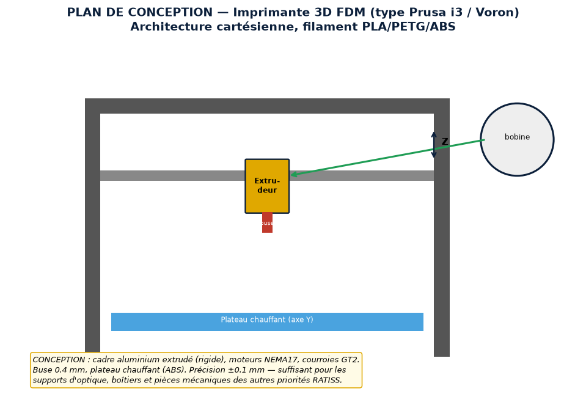
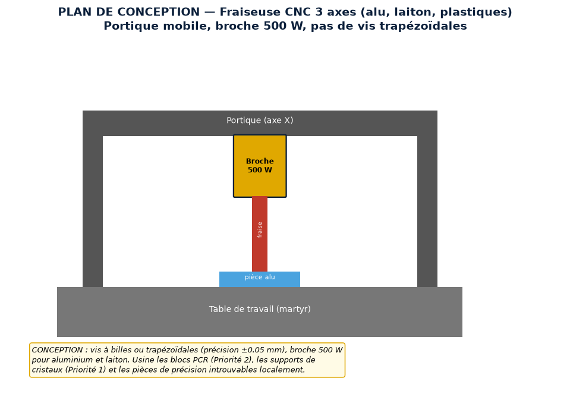
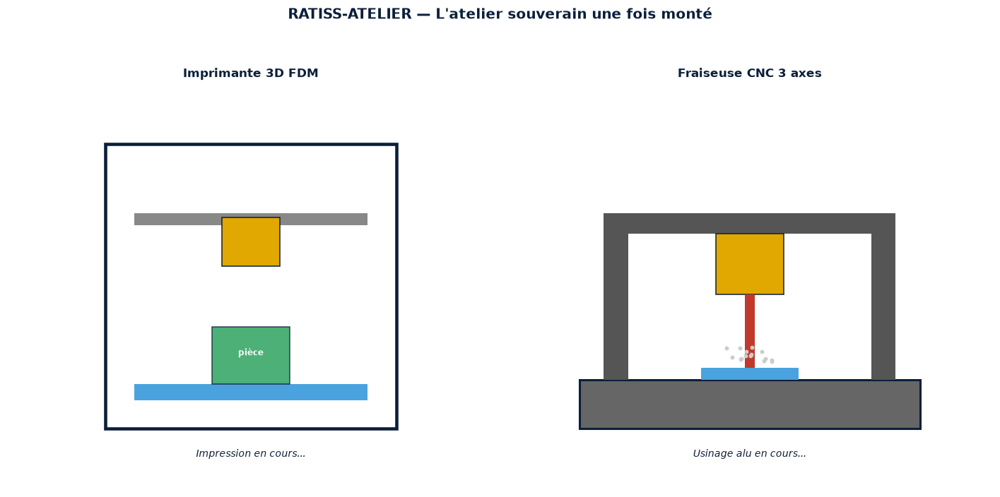
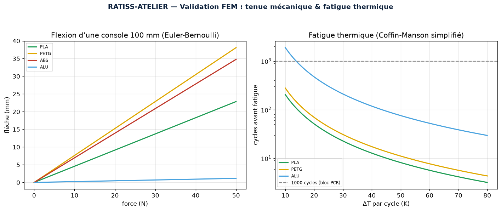
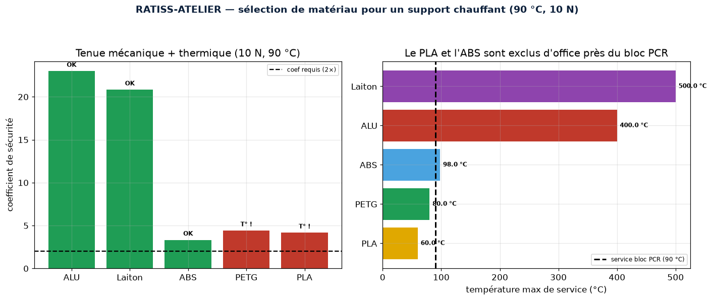
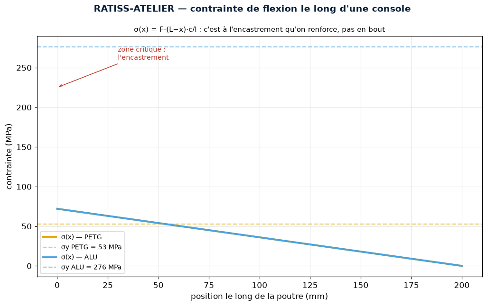

<p align="center">
  
</p>

[](https://github.com/jonathansearch)

<div align="center">


# 🏭 RATISS-ATELIER — L'Atelier de Fabrication Souverain

[](https://www.python.org/)
[](LICENSE)
[](CITATION.cff)
[](tests/)
[](https://orcid.org/0009-0000-4092-5313)

> Propriété intellectuelle : **JOHNKING0 & Jonathan Evina** · RATIS Labs (Cameroun)
> ORCID [0009-0000-4092-5313](https://orcid.org/0009-0000-4092-5313)

**[📘 Document de conception complet → DESIGN.md](DESIGN.md)** ·
**[🔧 Guide de montage → docs/ASSEMBLY.md](docs/ASSEMBLY.md)** ·
**[📦 Liste de matériel → docs/BOM.md](docs/BOM.md)** ·
**[🔬 Références → docs/PHYSICS.md](docs/PHYSICS.md)** ·
**[🧮 Validation math/physique → scripts/validate_physics.py](scripts/validate_physics.py)**

</div>

> **Priorité 4** de la doctrine de souveraineté technologique. Impression 3D
> (FDM) + usinage CNC 3 axes, avec **validation FEM in silico** avant chaque
> fabrication. La moindre pièce cassée n'arrête plus jamais le projet.

---

> 🇨🇲 **Un mot au Gouvernement de la République du Cameroun**
>
> Un support de cristal, un bloc de PCR, une simple équerre de précision :
> importés, ces composants coûtent des mois d'attente et des prix d'or.
> RATISS-ATELIER rend le Cameroun **capable de fabriquer lui-même** les pièces
> de ses instruments scientifiques — imprimées en 3D ou usinées à la CNC,
> validées par simulation mécanique avant de consommer le moindre gramme de
> matière. C'est la boucle de prototypage rapide, en heures et non en semaines,
> qui forme au passage une génération de techniciens CAO/CNC. **La souveraineté
> industrielle n'attend pas : elle se fabrique.**

---

## 🖼️ Le projet en images

### 🖨️ Plan de conception — Imprimante 3D FDM


### ⚙️ Plan de conception — Fraiseuse CNC 3 axes


### 🏭 Les machines une fois montées


### 📐 Validation FEM — flexion & fatigue thermique


### 🧪 Sélection de matériau — la température de service élimine d'office


### 📉 Carte de contrainte — on renforce l'encastrement, pas le bout


---

## 🎯 Pourquoi c'est une rupture

Les pièces détachées de laboratoire mettent des mois à arriver et coûtent une
fortune. La moindre pièce cassée arrête tout un projet. L'atelier souverain
brise ce verrou : **on conçoit, on simule (FEM), on fabrique, on teste, on
itère — en heures**.

Le simulateur FEM (`ratiss_atelier/fem.py`) valide chaque pièce **avant**
fabrication : flexion (Euler-Bernoulli), tenue en charge avec coefficient de
sécurité, dilatation thermique, fatigue thermique (Coffin-Manson). On ne
consomme du filament ou de l'aluminium que pour une pièce **déjà validée**.

## 🔧 Les machines

| Machine | Rôle | Précision |
|---------|------|-----------|
| Imprimante 3D FDM | boîtiers, supports, pièces plastiques | ±0.1 mm |
| Fraiseuse CNC 3 axes | blocs PCR, supports cristaux, alu/laiton | ±0.05 mm |

## 🚀 Quick start

```bash
pip install numpy matplotlib pytest
cd ratiss-atelier

# Choisir le bon matériau pour une pièce
PYTHONPATH=. python -c "
from ratiss_atelier.fem import choose_material, Beam, will_survive
for r in choose_material(force_n=10, length_m=0.1, t_service_c=90):
    print(f\"{r['material']:7s} tient: {r['survives']}  (coef sécu {r['safety_factor']:.1f})\")
"

# Figures
PYTHONPATH=. python scripts/generate_figures.py

# VALIDATION MATH & PHYSIQUE (Euler-Bernoulli, Coffin-Manson, matériaux)
PYTHONPATH=. python scripts/validate_physics.py

# G-CODE de la pièce de réception (FEM validée → instructions CNC)
PYTHONPATH=. python scripts/generate_gcode.py

# Tests
PYTHONPATH=. pytest tests/ -q
```

## 🏗️ Architecture du dépôt

```
ratiss_atelier/
├── fem.py              # FEM : flexion, contrainte, dilatation, fatigue
scripts/
├── generate_figures.py # 7 figures (plans, machines, FEM, sélection, logo)
├── validate_physics.py # Validation croisée (recalcul indépendant)
├── generate_gcode.py   # FEM validée → G-code GRBL (boucle fabrication)
tests/
├── test_atelier.py     # 14 tests
docs/
├── PHYSICS.md          # Références (Gere, Callister, Coffin)
├── BOM.md              # Liste de matériel (~759 k FCFA, phase 1 ~343 k)
├── ASSEMBLY.md         # Guide de montage + calibration
└── images/             # 7 figures générées
DESIGN.md               # Document de conception complet
LICENSE                 # MIT
CITATION.cff            # Citation académique (ORCID)
```

**La boucle complète** : `fem.py` valide la pièce → `generate_gcode.py` la
transforme en instructions machine → la CNC l'usine → la mesure recalibre la
FEM. Simulation et fabrication ne font qu'un.

## 🧮 Validation mathématique & physique

`scripts/validate_physics.py` recalcule **indépendamment** chaque résultat FEM
et le confronte à la littérature (Gere & Goodno, Callister, Coffin 1954) —
**8/8 validations** : cas manuel de flexion exact au mm près, lois d'échelle
δ∝F / δ∝L³ / δ∝1/E, dilatation, fatigue, sélection par température de service.

## 💰 Coût et montage

- **[📦 BOM détaillée](docs/BOM.md)** : ~759 k FCFA l'atelier complet, ou
  **~343 k pour l'imprimante 3D seule en phase 1** — elle produit déjà les
  pièces des priorités 1-3 et autofinance la CNC.
- **[🔧 Guide de montage](docs/ASSEMBLY.md)** : équerrage au comparateur,
  calibration (steps/mm, débit), arrêt d'urgence testé, pièce de réception,
  boucle de recalibrage FEM sur mesures réelles.

## ⚠️ Transparence ingénierie

Le modèle FEM est **simplifié** (poutre d'Euler-Bernoulli, Coffin-Manson) —
suffisant pour le dimensionnement, pas un calcul éléments finis complet.
La validation finale exige des essais mécaniques réels sur les pièces
fabriquées. **Toujours itérer, jamais figé.**

---

## 📄 Licence & citation

- **Licence** : [MIT](LICENSE) — © JOHNKING0 & Jonathan Evina, RATIS Labs (Cameroun).
- **Citation** : voir [CITATION.cff](CITATION.cff) — ORCID
  [0009-0000-4092-5313](https://orcid.org/0009-0000-4092-5313).

---

*Doctrine matérielle souveraine du Cameroun — Priorité 4 sur 5.*

## Installation

Install the repository according to its package manifest and environment requirements.

## Usage

Refer to the repository modules, examples, and scripts for the supported execution interfaces.

## Validation Results

Validation commands and observed results are recorded in [AUDIT_REPORT.md](AUDIT_REPORT.md).

## License

Copyright 2026 RATISS Labs. All rights reserved. Licensed under the Apache License, Version 2.0.
