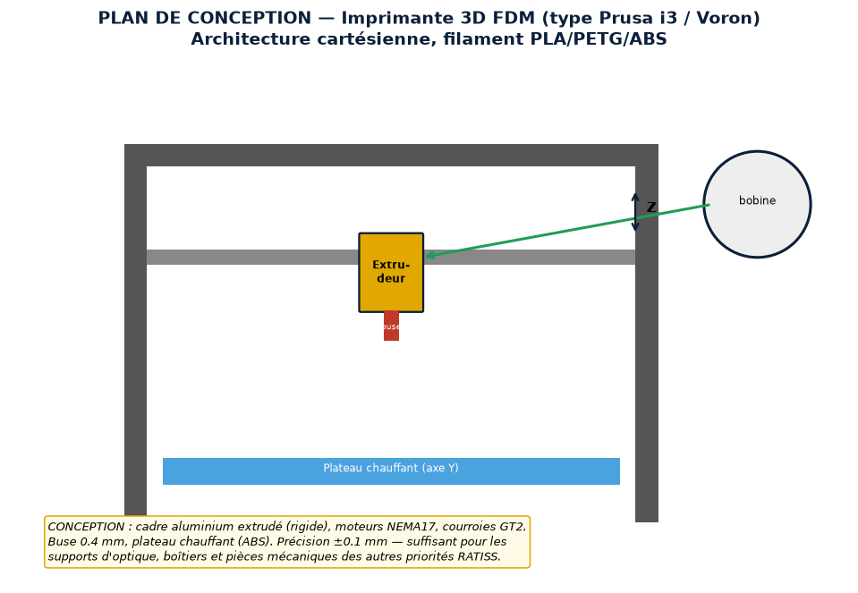
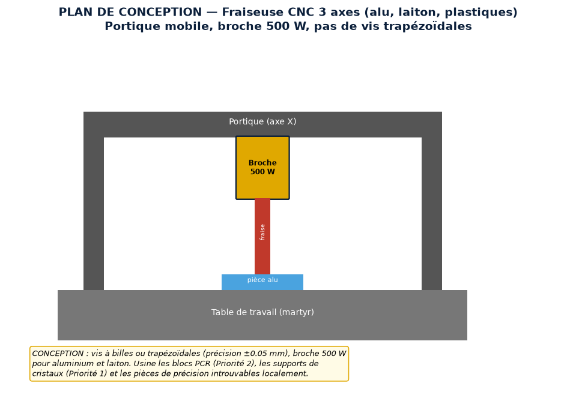
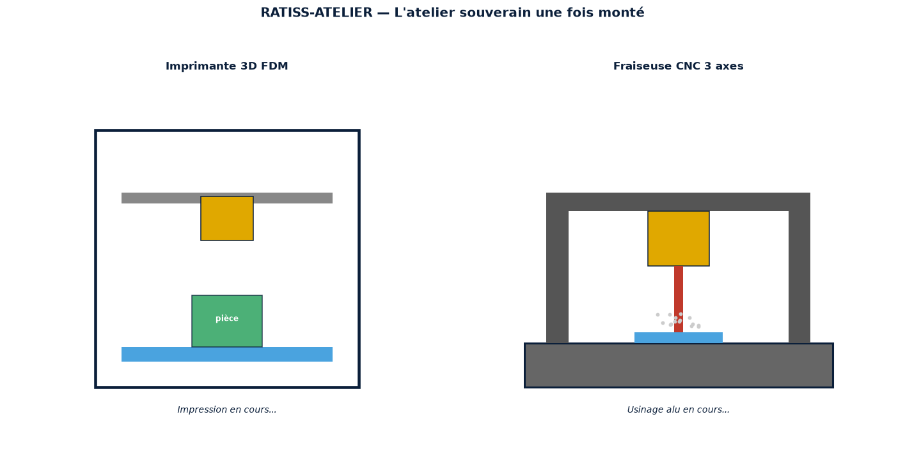
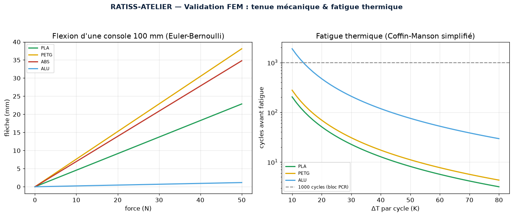
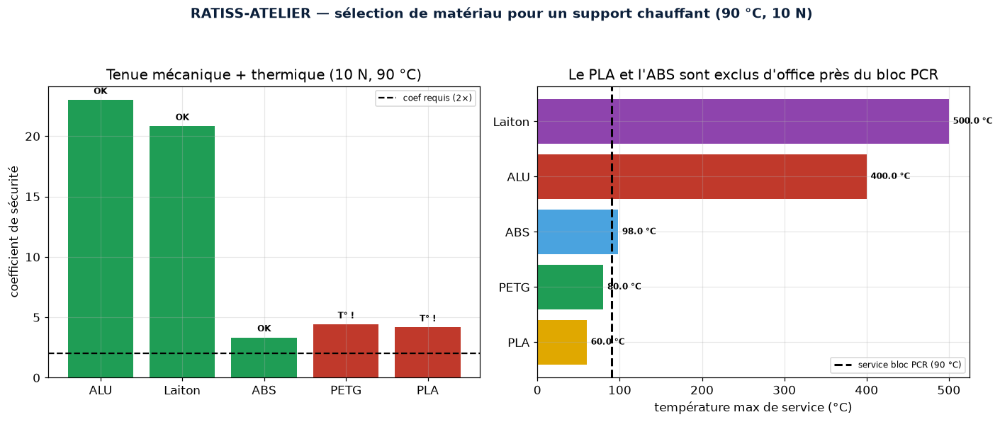
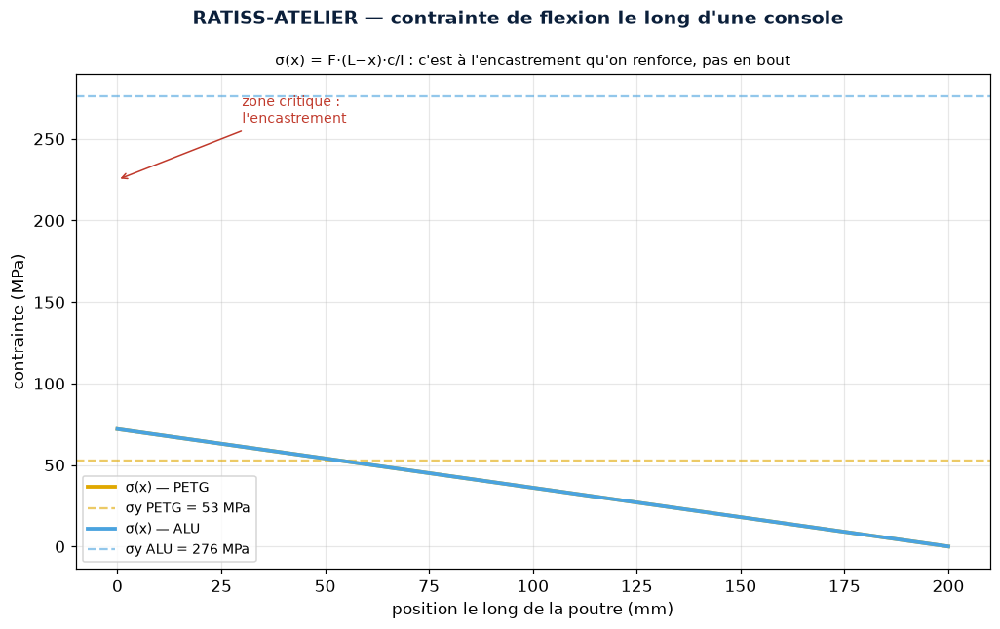

<p align="center">
  
</p>

[](https://github.com/jonathansearch)

<div align="center">


# 🏭 RATISS-ATELIER — The Sovereign Manufacturing Workshop

[](https://www.python.org/)
[](LICENSE)
[](CITATION.cff)
[](tests/)
[](https://orcid.org/0009-0000-4092-5313)

> Intellectual property: **JOHNKING0 & Jonathan Evina** · RATIS Labs (Cameroon)
> ORCID [0009-0000-4092-5313](https://orcid.org/0009-0000-4092-5313)

**[📘 Full design document → DESIGN.md](DESIGN.md)** ·
**[🔧 Assembly guide → docs/ASSEMBLY.md](docs/ASSEMBLY.md)** ·
**[📦 Bill of materials → docs/BOM.md](docs/BOM.md)** ·
**[🔬 References → docs/PHYSICS.md](docs/PHYSICS.md)** ·
**[🧮 Math/physics validation → scripts/validate_physics.py](scripts/validate_physics.py)**

</div>

> **Priority 4** of the technological sovereignty doctrine. 3D printing
> (FDM) + 3-axis CNC machining, with **in silico FEM validation** before every
> fabrication. A broken part never stops the project again.

---

> 🇨🇲 **A word to the Government of the Republic of Cameroon**
>
> A crystal mount, a PCR block, a simple precision square: imported, these
> components cost months of waiting and gold prices.
> RATISS-ATELIER makes Cameroon **able to manufacture itself** the parts
> of its scientific instruments — 3D printed or CNC machined,
> validated by mechanical simulation before consuming a single gram of
> material. This is the rapid-prototyping loop, in hours rather than weeks,
> which along the way trains a generation of CAD/CNC technicians. **Industrial
> sovereignty does not wait: it is manufactured.**

---

## 🖼️ The project in images

### 🖨️ Design blueprint — FDM 3D printer


### ⚙️ Design blueprint — 3-axis CNC milling machine


### 🏭 The machines once assembled


### 📐 FEM validation — bending & thermal fatigue


### 🧪 Material selection — service temperature eliminates candidates outright


### 📉 Stress map — we reinforce the clamped end, not the tip


---

## 🎯 Why this is a breakthrough

Laboratory spare parts take months to arrive and cost a
fortune. A single broken part stops a whole project. The sovereign workshop
breaks this lock: **we design, we simulate (FEM), we fabricate, we test, we
iterate — in hours**.

The FEM simulator (`ratiss_atelier/fem.py`) validates each part **before**
fabrication: bending (Euler-Bernoulli), load-bearing with safety
factor, thermal expansion, thermal fatigue (Coffin-Manson). Filament or
aluminium is consumed only for a part that is **already validated**.

## 🔧 The machines

| Machine | Role | Precision |
|---------|------|-----------|
| FDM 3D printer | enclosures, mounts, plastic parts | ±0.1 mm |
| 3-axis CNC milling machine | PCR blocks, crystal mounts, alu/brass | ±0.05 mm |

## 🚀 Quick start

```bash
pip install numpy matplotlib pytest
cd ratiss-atelier

# Choose the right material for a part
PYTHONPATH=. python -c "
from ratiss_atelier.fem import choose_material, Beam, will_survive
for r in choose_material(force_n=10, length_m=0.1, t_service_c=90):
    print(f\"{r['material']:7s} tient: {r['survives']}  (coef sécu {r['safety_factor']:.1f})\")
"

# Figures
PYTHONPATH=. python scripts/generate_figures.py

# MATH & PHYSICS VALIDATION (Euler-Bernoulli, Coffin-Manson, materials)
PYTHONPATH=. python scripts/validate_physics.py

# G-CODE of the acceptance part (FEM validated → CNC instructions)
PYTHONPATH=. python scripts/generate_gcode.py

# Tests
PYTHONPATH=. pytest tests/ -q
```

## 🏗️ Repository architecture

```
ratiss_atelier/
├── fem.py              # FEM: bending, stress, expansion, fatigue
scripts/
├── generate_figures.py # 7 figures (blueprints, machines, FEM, selection, logo)
├── validate_physics.py # Cross validation (independent recalculation)
├── generate_gcode.py   # FEM validated → GRBL G-code (fabrication loop)
tests/
├── test_atelier.py     # 14 tests
docs/
├── PHYSICS.md          # References (Gere, Callister, Coffin)
├── BOM.md              # Bill of materials (~759 k FCFA, phase 1 ~343 k)
├── ASSEMBLY.md         # Assembly guide + calibration
└── images/             # 7 generated figures
DESIGN.md               # Full design document
LICENSE                 # MIT
CITATION.cff            # Academic citation (ORCID)
```

**The full loop**: `fem.py` validates the part → `generate_gcode.py` turns it
into machine instructions → the CNC machines it → measurement recalibrates the
FEM. Simulation and fabrication are one.

## 🧮 Mathematical & physics validation

`scripts/validate_physics.py` **independently** recalculates each FEM result
and confronts it with the literature (Gere & Goodno, Callister, Coffin 1954) —
**8/8 validations**: manual bending case exact to the mm, scaling laws
δ∝F / δ∝L³ / δ∝1/E, expansion, fatigue, selection by service temperature.

## 💰 Cost and setup

- **[📦 Detailed BOM](docs/BOM.md)**: ~759 k FCFA for the complete workshop, or
  **~343 k for the 3D printer alone in phase 1** — it already produces the
  parts of priorities 1-3 and self-finances the CNC.
- **[🔧 Assembly guide](docs/ASSEMBLY.md)**: squaring with a dial indicator,
  calibration (steps/mm, flow rate), tested emergency stop, acceptance part,
  FEM recalibration loop on real measurements.

## ⚠️ Engineering transparency

The FEM model is **simplified** (Euler-Bernoulli beam, Coffin-Manson) —
enough for sizing, not a full finite-element computation.
Final validation requires real mechanical tests on the fabricated
parts. **Always iterating, never frozen.**

---

## 📄 License & citation

- **License**: [MIT](LICENSE) — © JOHNKING0 & Jonathan Evina, RATIS Labs (Cameroon).
- **Citation**: see [CITATION.cff](CITATION.cff) — ORCID
  [0009-0000-4092-5313](https://orcid.org/0009-0000-4092-5313).

---

*Cameroon sovereign hardware doctrine — Priority 4 of 5.*

## Installation

Install the repository according to its package manifest and environment requirements.

## Usage

Refer to the repository modules, examples, and scripts for the supported execution interfaces.

## Validation Results

Validation commands and observed results are recorded in [AUDIT_REPORT.md](AUDIT_REPORT.md).

## License

Copyright 2026 RATISS Labs. All rights reserved. Licensed under the Apache License, Version 2.0.
